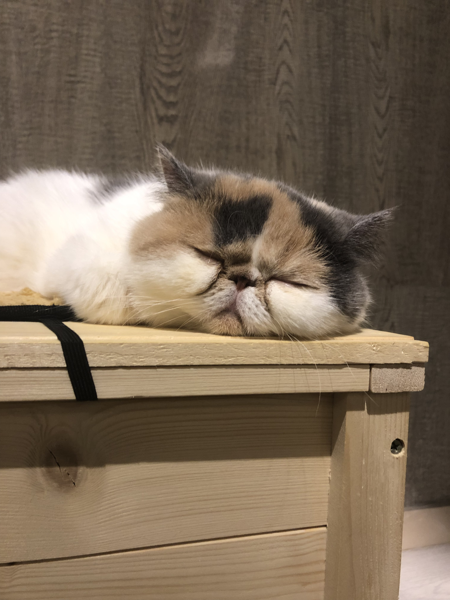

# My Page

`Hello World!`
# Introduction
---
> Hi, I'm **Wing** from Hong Kong. I'm a transfer student from Pasadena City College and this is my first year at UCSD. I'm currently living on campus at Matthews. Here are [some courses](#Courses) I'm taking in this quarter. I like cats but I don't have one. This photo was taking in a cat cafe in Japan. 

# Courses
---
Some Courses I'm taking right now
1. CSE 110
2. CSE 140/140L
3. CSE 105
4. EDS 124AR

# Project
---
- 6nimmt!
- Logo Maker 

Both of them were done in C++. The first one is a famous card game and the second one is a UI where people can create their own logo by changing its color, size, front etc.. Both of them can be found in my [github](https://github.com/wingchan852). I have some/ little experiences in web develop like the basic CSS, HTML, JavaScript and React stuff. 

 - [x] Ccomplete 
